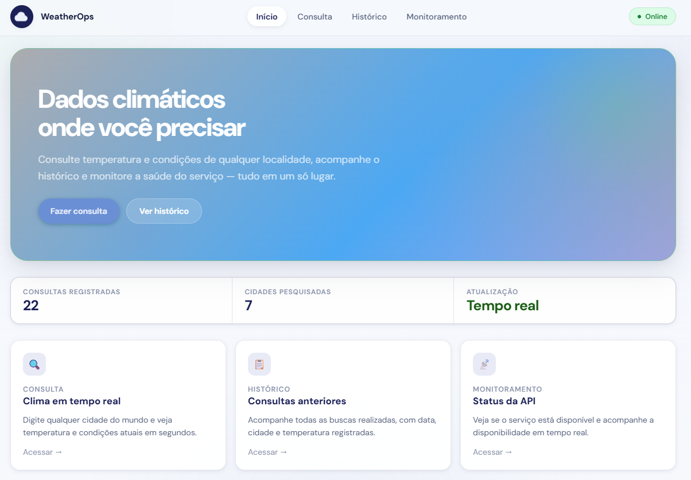

# WeatherOps

WeatherOps é uma aplicação fullstack para consulta de dados meteorológicos em tempo real, com histórico de buscas persistente e monitoramento de disponibilidade da API. O sistema registra automaticamente a saúde do serviço a cada 60 segundos, permitindo acompanhar oscilações de disponibilidade e tempo de resposta ao longo do tempo.

## Preview

<div style="max-width: 600px; overflow: hidden;">
  
</div>

> Acesse via: https://weather.lucasaguiar.online/

## Tecnologias

- **Frontend:** React 18 com TypeScript, Vite, TanStack Query
- **Backend:** Python 3.13, FastAPI, PostgreSQL
- **Infraestrutura:** Docker, Docker Compose, Nginx (reverse proxy)
- **API externa:** OpenWeatherMap

## Funcionalidades

- Consulta de dados meteorológicos por cidade via OpenWeatherMap
- Histórico de buscas armazenado em banco de dados relacional
- Monitoramento de disponibilidade com gráfico de barras das últimas 24 horas
- Métricas de uptime, tempo médio de resposta, total de checagens e último incidente
- Interface responsiva e componentizada

## Estrutura do projeto

```text
WeatherOps/
├── backend/
│   ├── app/            # Rotas, serviços e lógica de negócio
│   └── database/       # Scripts SQL e modelagem
├── frontend/
│   ├── src/            # Componentes, hooks e serviços
│   ├── Dockerfile      # Build multi-stage (Node + Nginx)
│   └── nginx.conf      # Configuração de proxy reverso
└── docker-compose.yml  # Orquestração dos serviços
```

## Configuração

Crie um arquivo `.env` na raiz do projeto com as variáveis abaixo:

```env
API_KEY=seu_token_openweathermap
DB_NAME=weather_db
USER=weather_user
PASSWORD=sua_senha

FRONTEND_URL=http://localhost:5173
VITE_API_URL=http://localhost:8000
```

## Como executar

### Via Docker (recomendado)

Sobe todos os serviços com um único comando. O Nginx serve o frontend na porta 80 e encaminha as requisições de API.

```bash
docker compose up --build -d
```

Acesse: `http://localhost`

### Desenvolvimento local

**Backend:**

```bash
pip install -r requirements.txt
uvicorn backend.app.main:app --reload
```

**Frontend:**

```bash
cd frontend
npm install
npm run dev
```

## Licença

Este projeto está sob a licença MIT. Veja o arquivo [LICENSE](./LICENSE) para mais detalhes.
